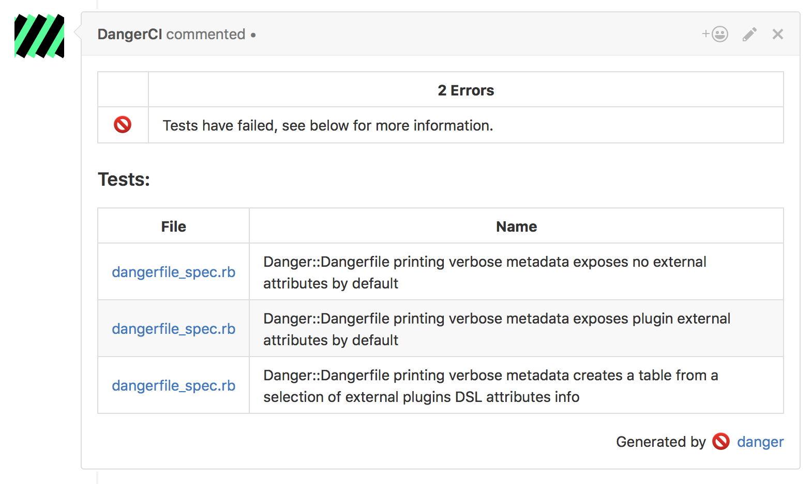

# danger-junit

This Danger Plugin allows you to standardise the output for all of your testing runs. Most test runners include an ability to have a reporter that conforms to the JUnit XML standard. This plugin will understand that file and offer a way to introspect it, and to report on it.



## Installation

    $ gem install danger-junit

## Usage

### Ruby

For Rspec, add the gem `rspec_junit_formatter` to your project. Then use a `.rspec` file to configure your tests to have multiple reporters. This file looks like:

``` sh
...
--format documentation
--format RspecJunitFormatter --out junit-results.xml
...
```

Then you can pass the `junit-results.xml` file to the plugin in your `Dangerfile`.

### JS

In a Jasmine, or Jest testing project, you want to install the module `jasmine-reporters`. Then as you are setting up your Jasmine runner, [add the following](https://github.com/larrymyers/jasmine-reporters#basic-usage):

```javascript
var junitReporter = new jasmineReporters.JUnitXmlReporter({
    savePath: 'junit-results.xml',
    consolidateAll: false
});
jasmine.getEnv().addReporter(junitReporter);
```

Then you can pass the `junit-results.xml` file to the plugin in your `Dangerfile`.

### iOS

You have a lot of options:

* [trainer](https://github.com/krausefx/trainer) is the fastest way to generate the junit file.
* [xcpretty](https://github.com/supermarin/xcpretty#reporters)  is used in both [fastlane](https://fastlane.tools), and a lot of standard setups.
* [xctool](https://github.com/facebook/xctool#included-reporters) includes it's own reporter for creating the file.

### JUnit

Report, or inspect any JUnit XML formatted test suite report.

Testing frameworks have standardized on the JUnit XML format for
reporting results, this means that projects using Rspec, Jasmine, Mocha,
XCTest and more - can all use the same Danger error reporting. Perfect.

You can see some examples on [this page from Circle CI](https://circleci.com/docs/test-metadata/) and on this [project's README](https://github.com/orta/danger-junit.git)
about how you can add JUnit XML output for your testing projects.

<blockquote>Parse the XML file, and let the plugin do your reporting
  <pre>
junit.parse "/path/to/output.xml"
junit.report</pre>
</blockquote>

<blockquote>Let the plugin parse the XML file, and report yourself
  <pre>
junit.parse "/path/to/output.xml"
fail("Tests failed") unless junit.failures.empty?</pre>
</blockquote>

<blockquote>Warn on a report about skipped tests
  <pre>
junit.parse "/path/to/output.xml"
junit.show_skipped_tests = true
junit.report</pre>
</blockquote>

<blockquote>Only show specific parts of your results
  <pre>
junit.parse "/path/to/output.xml"
junit.headers = [:name, :file]
junit.report</pre>
</blockquote>

<blockquote>Only show specific parts of your results
  <pre>
junit.parse "/path/to/output.xml"
all_test = junit.tests.map(&:attributes)
slowest_test = sort_by { |attributes| attributes[:time].to_f }.last
message "#{slowest_test[:time]} took #{slowest_test[:time]} seconds"</pre>
</blockquote>


#### Attributes

`tests` - All the tests for introspection

`passes` - An array of XML elements that represent passed tests.

`failures` - An array of XML elements that represent failed tests.

`errors` - An array of XML elements that represent passed tests.

`skipped` - An array of XML elements that represent skipped tests.

`show_skipped_tests` - An attribute to make the plugin show a warning on skipped tests.

`headers` - An array of symbols that become the columns of your tests,
if `nil`, the default, it will be all of the attributes.


#### Methods

`parse` - Parses an XML file, which fills all the attributes,
will `raise` for errors

`report` - Causes a build fail if there are test failures,
and outputs a markdown table of the results.


## Development

1. Clone this repo
2. Run `bundle install` to setup dependencies.
3. Run `bundle exec rake spec` to run the tests.
4. Use `bundle exec guard` to automatically have tests run as you make changes.
5. Make your changes.
